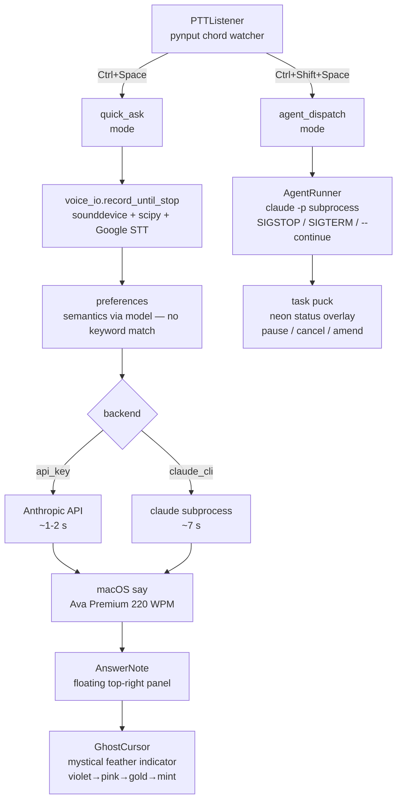

# Curby

[](LICENSE)
[](https://www.python.org/)
[](https://www.apple.com/macos/)

**Voice-driven desktop companion for Claude: press `Ctrl+Space`, speak a question, get a spoken answer in ~1–2 s — or press `Ctrl+Shift+Space` to dispatch an autonomous Claude Code agent that runs the task in a sandboxed workspace.**

**Status:** v0.3 — quick-ask voice loop, mystical feather indicator, floating answer note, pluggable fast backend, voice meta-commands, interrupt mid-speech.

**[▶ Live demo](https://casterlygit.github.io/curby/)** — simulated macOS desktop; hit Ctrl+Space, watch a task puck spawn and stream through running → done states.

---

## Signal above the fold

| What | Detail |
|---|---|
| **Quick-ask latency** | ~1–2 s end-to-end with `api_key` backend (Anthropic API); ~7 s with `claude_cli` default |
| **TTS voice** | macOS `say` — Ava (Premium) recommended, 220 WPM |
| **Conversation window** | 60 s rolling — follow-up questions see the prior exchange |
| **Agent sandboxing** | Each `Ctrl+Shift+Space` task gets its own `~/curby-tasks/<timestamp>-<slug>/` workspace |
| **Observability** | Every quick-ask logged to `~/.curby/quick-ask-log.jsonl` (prompt / reply / latency / `was_followup`) |
| **Platform** | macOS (Accessibility + Microphone permissions required); Python layer is cross-platform |

---

## Architecture



---

## Why

The friction of context-switching to a chat window kills flow. Curby keeps Claude ambient — one chord, a spoken answer, back to what you were doing. The feather stays in your peripheral vision so you always know curby's state without looking at a window.

---

## Quick start

**Prereqs** — Python 3.12+, [Claude Code](https://docs.anthropic.com/en/docs/claude-code) installed (`claude` on PATH), microphone with system permission, and on macOS: Accessibility permission for your terminal/Python (pynput needs it for the global hotkey listener).

```bash
git clone https://github.com/CasterlyGit/curby.git
cd curby
python3 -m venv .venv && source .venv/bin/activate
pip install -r requirements.txt
python main.py
```

Recommended one-time setup for the best feel:

1. **Install Ava (Premium)** — System Settings → Accessibility → Spoken Content → System Voice → click (i) → download "Ava (Premium)" (~100 MB). Vastly more natural than the default.
2. **Pick a fast backend** — drop a config at `~/.curby/config.json`:
   ```json
   {
     "voice": "Ava (Premium)",
     "rate": 220,
     "backend": "api_key",
     "api_key": "sk-ant-..."
   }
   ```
   Without `backend`, quick-ask uses `claude_cli` (~7 s per turn). With `api_key` (or a custom backend file you point at), expect ~1–2 s.

---

## Usage

### Hotkeys

| Key | Action |
|---|---|
| **`Ctrl+Space`** (toggle) | **quick-ask** — voice question → spoken Claude answer. First tap opens mic, second tap sends. Mid-speech tap interrupts + restarts. |
| **`Ctrl+Shift+Space`** (toggle) | spawn an agent task — voice → sandboxed Claude Code agent with a status puck. |
| `Ctrl+.` | type a prompt instead of speaking (agent mode only) |
| `Esc` | quit |

### Quick-ask in practice

- Tap `Ctrl+Space`, ask *"what are WebSockets?"* → hear a short analogy-led answer (~1–2 s).
- Tap again (within 60 s), ask *"but what does full-duplex mean?"* → Claude sees the prior turn.
- Voice meta-commands (no keyword matching — Claude interprets semantics):
  - *"be shorter"* → all future replies under 10 words
  - *"more detail"* → 2–3 sentence answers
  - *"more technical"* → engineering-tier vocabulary
  - *"explain like I'm five"* → fully simplified
  - *"go back to normal"* → reset style + conversation
- Tap the `—` button on the answer note to collapse to a pulsing dot. Color reflects state (blue idle / pink listening / violet thinking / mint speaking).

### Agent dispatch

`Ctrl+Shift+Space`, speak a task. A sandboxed agent picks it up in `~/curby-tasks/<timestamp>-<slug>/`. Hover the puck for pause / cancel / amend controls.

---

## Config

All config lives at `~/.curby/config.json`. Supported keys:

| Key | Default | Description |
|---|---|---|
| `voice` | system default | macOS `say` voice name (e.g. `"Ava (Premium)"`) |
| `rate` | 200 | TTS words-per-minute |
| `backend` | `"claude_cli"` | `"claude_cli"` / `"api_key"` / absolute path to a custom `.py` file |
| `api_key` | — | Anthropic API key (only used with `"api_key"` backend) |

Custom backend files: drop any Python file that exposes `def ask(prompt, history) -> str` at the path you set in `backend`.

---

## Observability

Every quick-ask round-trip is appended to `~/.curby/quick-ask-log.jsonl`:

```json
{"ts": "2025-05-01T12:34:56", "prompt": "what are websockets?", "reply": "...", "latency_s": 1.3, "was_followup": false, "backend": "api_key"}
```

Use `jq` to slice it — e.g. average latency: `jq -s '[.[].latency_s] | add/length' ~/.curby/quick-ask-log.jsonl`.

---

## Roadmap

Shipped:
- [x] v0.1 — voice → agent dispatch with task pucks
- [x] v0.2 — Premium voice picker, claude-meter-style collapsible answer note
- [x] v0.3 — quick-ask voice loop, conversational follow-ups, voice meta-commands, fast backend, ghost-cursor feather indicator, interrupt mid-speech

Open:
- [ ] Persistent claude subprocess that doesn't accumulate context ([#20](https://github.com/CasterlyGit/curby/issues/20))
- [ ] Configurable TTS voice + rate UI (currently config-file only) ([#16](https://github.com/CasterlyGit/curby/issues/16))
- [ ] Visual animations alongside spoken answers (concept library)

---

## Related projects

| Repo | What |
|---|---|
| [curby-jarvis](https://github.com/CasterlyGit/curby-jarvis) | Hybrid Capability Router — point-and-say controller, AX spine, Frosted Console overlay |
| [hand-signal](https://github.com/CasterlyGit/hand-signal) | Gesture detection layer that feeds into curby dispatch |
| [laptop-dictation](https://github.com/CasterlyGit/laptop-dictation) | Lightweight dictation daemon, shares the PTT model |
| [claude-meter](https://github.com/CasterlyGit/claude-meter) | Desktop usage meter — same collapsible-floater pattern as the answer note |

---

## License

MIT.
