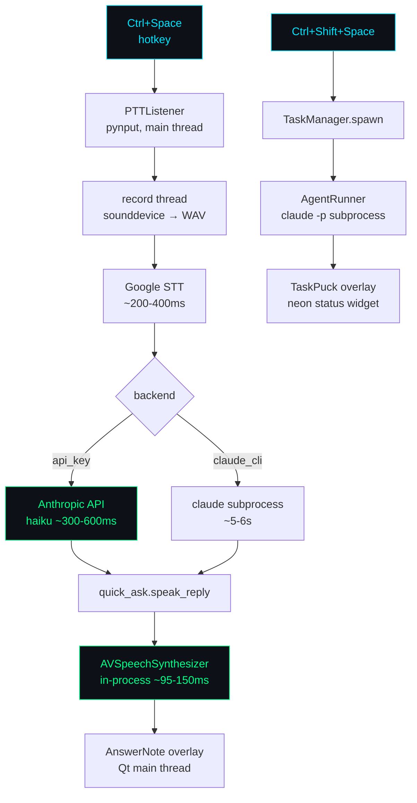

# Curby

[](https://github.com/CasterlyGit/curby/actions/workflows/ci.yml)
[](https://www.python.org/)
[](LICENSE)

> **Press Ctrl+Space. Speak. Hear Claude reply in ~1 second.**
> Press Ctrl+Shift+Space instead, and an autonomous Claude Code agent runs your task in a sandbox.

**Status:** v0.4 — shipping, auto-starts at login, CI green. macOS only.

**[▶ Live demo](https://casterlygit.github.io/curby/)** · **[Design doc](docs/DESIGN.md)** · **[Benchmarks](docs/benchmarks.md)**

```
Ctrl+Space        → quick-ask    → spoken reply in ~1s     (Ava Premium, in-process TTS)
Ctrl+Shift+Space  → agent task   → sandboxed claude -p     (status puck on right edge)
Ctrl+.            → type instead of speak (agent only)
Esc               → quit
```

---

## Why it's fast

| Phase | Naive | curby | How |
|---|---|---|---|
| TTS | 400–600ms (`say`) | **95–150ms** | AVSpeechSynthesizer in-process; engine stays resident |
| LLM | 2–4s (CLI bootstrap) | **280–600ms** | api_key backend; pre-warmed TCP+TLS on startup |
| STT | 200–400ms | 200–400ms | Google STT (network-bound) |
| **Wall-clock** | 3–5s | **~1s p50** | Prewarm + in-process TTS + threaded pipeline |

Measured numbers + methodology in [docs/benchmarks.md](docs/benchmarks.md).

---

## Highlights

- **Conversational follow-ups** — 60s window keeps prior turns; "what are WebSockets?" → "but what does full-duplex mean?" works.
- **Voice meta-commands** — say *"be shorter"*, *"more technical"*, *"like I'm five"*, *"go back to normal"*. Semantic detection via Claude, not keyword matching.
- **Interrupt mid-speech** — tap Ctrl+Space while Ava is talking; TTS dies, mic opens, <1ms.
- **Two backends, one app** — `claude_cli` works on any Max plan with zero setup (slow); `api_key` is ~1s (needs `ANTHROPIC_API_KEY`). Drop a custom Python file at any path to roll your own.

---

## Quick start

**Prereqs** — Python 3.11+, [Claude Code](https://docs.anthropic.com/en/docs/claude-code) installed (`claude` on PATH), microphone with system permission, and on macOS: Accessibility permission for your terminal/Python (pynput needs it for the global hotkey listener).

```bash
git clone https://github.com/CasterlyGit/curby.git
cd curby
python3 -m venv .venv && source .venv/bin/activate
pip install -r requirements.txt
python main.py
```

Recommended one-time setup for the best feel:

1. **Install Ava (Premium)** — System Settings → Accessibility → Spoken Content → System Voice → click (i) → download "Ava (Premium)" (~100 MB). Vastly more natural than the default.
2. **Pick a fast backend** — drop a config at `~/.curby/config.json`:
   ```json
   {
     "voice": "Ava (Premium)",
     "rate": 220,
     "backend": "api_key",
     "api_key": "sk-ant-..."
   }
   ```
   Without `backend`, quick-ask uses `claude_cli` (~7s per turn). With `api_key` (or any custom backend file you point at), expect ~1-2s.

### Auto-start at login

```bash
./scripts/install-autostart.sh
```

Installs `com.casterly.curby` as a LaunchAgent so curby launches every time you log in. Logs at `/tmp/curby.log`. Uninstall via `launchctl unload ~/Library/LaunchAgents/com.casterly.curby.plist && rm ~/Library/LaunchAgents/com.casterly.curby.plist`.

---

## How to use

### Talk to it

| Key | What it does |
|---|---|
| **`Ctrl+Space`** (toggle) | **quick-ask** — voice question → short spoken Claude answer in the answer note. First tap opens mic, second tap sends. Mid-speech tap interrupts + starts new question. |
| **`Ctrl+Shift+Space`** (toggle) | spawn an agent task — voice → sandboxed Claude Code agent with a status puck. |
| `Ctrl+.` | type a prompt instead of speaking (agent only) |
| `Esc` | quit |

### Quick-ask in practice

- Tap `Ctrl+Space`, ask *"what are WebSockets?"* → hear a short analogy-led answer (~1-2s).
- Tap again (within 60s), ask *"but what does full-duplex mean?"* → Claude sees the prior turn, gives a contextual follow-up.
- At any point, say one of:
  - *"be shorter"* → all future replies under 10 words
  - *"more detail"* → 2-3 sentence answers
  - *"more technical"* → engineering-tier vocabulary
  - *"explain like I'm five"* → fully simplified
  - *"go back to normal"* → reset both style + conversation
- Tap the `—` button on the answer note to collapse it to a pulsing dot. Color + speed mirror state (blue idle, pink listening, violet thinking, mint speaking). Click the dot to expand.
- Every quick-ask is logged to `~/.curby/curby.log` (structured) and `~/.curby/quick-ask-log.jsonl` (legacy, per-call detail).

### Agent dispatch

Same as before. `Ctrl+Shift+Space`, speak a task, a sandboxed agent picks it up in `~/curby-tasks/<timestamp>-<slug>/`. Hover the puck for pause / cancel / amend.

---

## How the latency was achieved

**The problem:** voice → spoken reply involves 4 serial phases. Each one had to be attacked independently.

| Phase | Naive | Optimized | How |
|---|---|---|---|
| TTS | 400–600ms (`say` subprocess) | 95–150ms | AVSpeechSynthesizer in-process; engine stays loaded between calls |
| LLM | 2–4s (claude_cli bootstrap) | 280–600ms | api_key backend skips subprocess; pre-warmed TCP+TLS on startup |
| STT | 200–400ms | 200–400ms | Google STT; bottleneck is network, not local processing |
| Overhead | ~200ms | ~30ms | Removed per-call module imports; moved keychain read to startup |

**Prewarm design:** On curby launch, the api_key backend opens a TCP+TLS connection to `api.anthropic.com` and reads the keychain once. First Ctrl+Space sees a warm connection. Measured prewarm cost: **42ms p50 TCP+TLS** (see [docs/benchmarks.md](docs/benchmarks.md)). The prewarm runs in a background thread and does not block startup.

**AVSpeechSynthesizer vs `say`:** `say` spawns a new process per call (~150–200ms startup). AVSpeechSynthesizer loads the voice engine once (via PyObjC) and keeps it resident. Measured TTFS: **250ms cold, 125ms warm p50** (Ava Premium, from `speakUtterance_()` to `didStartSpeechUtterance_` callback).

**Threading model:** Qt main thread handles UI and hotkey events. STT and LLM run on background threads (Python `threading`). AVSpeechSynthesizer has an AVFoundation constraint: it must be called from a thread with a run loop. Satisfied by calling it from the Qt main thread via a signal/slot emit through `_Bridge`.

**Interrupt handling:** If Ctrl+Space fires while TTS is playing, `AVSpeechSynthesizer.stopSpeakingAtBoundary_(AVSpeechBoundaryImmediate)` is called (synchronous, <1ms), then the new recording starts. No buffering delay.

See [docs/benchmarks.md](docs/benchmarks.md) for full measured numbers and methodology.

---

## Architecture



Thread boundaries: `PTTListener` runs on a pynput OS thread; recording and LLM calls run on Python `threading.Thread`s; all Qt widget updates are marshaled through `_Bridge` pyqtSignal to the Qt main thread (the only thread allowed to touch widgets).

---

## How it works

See [docs/DESIGN.md](docs/DESIGN.md) for the full breakdown — architecture diagram, latency analysis, key decisions, and failure modes.

The short version:

- **`PTTListener`** — pynput chord watcher.
- **`voice_io.record_until_stop`** — sounddevice + scipy + Google STT, streams per-chunk RMS as audio level callbacks.
- **`GhostCursor`** — the mystical feather. Frameless Qt widget with state-driven color + soft aura. Pinned next to the answer note (decoupled from system cursor to avoid macOS input lag).
- **`AnswerNote` + `CollapsibleFloater`** — top-right text panel showing the latest quick-ask reply.
- **`quick_ask` + `quick_ask_backends/`** — pluggable backend system (`claude_cli`, `api_key`, custom-file). Conversation history + system prompt addendum support.
- **`preferences`** — semantic style preferences detected via the model itself (no keyword matching).
- **`AgentRunner`** — wraps one `claude` subprocess per agent task with stream-json parsing, SIGSTOP/SIGCONT pause, SIGTERM/SIGKILL cancel, `--continue` queueing.
- **`pidfile`** — kills stale curby instances on startup; prevents orphan overlays after force-kills.
- **`mac_window.make_always_visible`** — PyObjC shim that pins overlays at NSStatusWindowLevel + `canJoinAllSpaces`.

---

## Observability

Every quick-ask and agent dispatch writes a structured JSON line to `~/.curby/curby.log`:

```json
{"ts": "2026-05-25T10:03:12Z", "event": "quick_ask", "backend": "api_key", "ttft_ms": 210, "total_ms": 890, "was_followup": false, "error": null}
{"ts": "2026-05-25T10:03:45Z", "event": "agent_dispatch", "prompt_chars": 42, "workdir": "~/curby-tasks/20260525-100345-build-a-script"}
{"ts": "2026-05-25T10:03:58Z", "event": "agent_done", "exit_code": 0, "total_ms": 13200, "cancelled": false}
```

Tail with color:

```bash
./curby log
```

---

## Roadmap

Shipped:
- [x] v0.1 — voice → agent dispatch with task pucks
- [x] v0.2 — Premium voice picker, claude-meter-style collapsible answer note
- [x] v0.3 — quick-ask voice loop, conversational follow-ups, voice meta-commands, OAuth fast backend, ghost-cursor feather indicator, interrupt mid-speech
- [x] v0.4 — CI (pytest + ruff), structured logging, `curby log` command, `docs/DESIGN.md`

Open:
- [ ] Persistent claude subprocess that doesn't accumulate context (#20)
- [ ] Configurable TTS voice + rate UI (currently config-file only) (#16)
- [ ] Visual animations alongside spoken answers (concept library)

---

## License

MIT.
